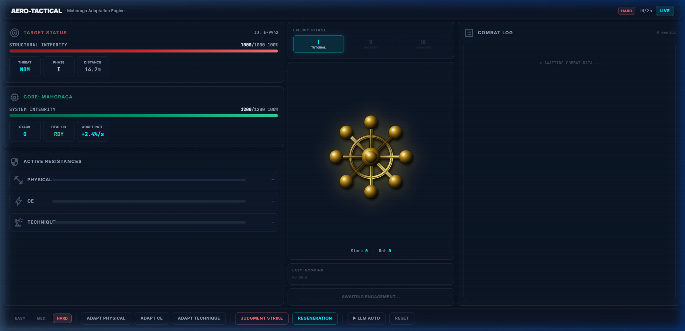
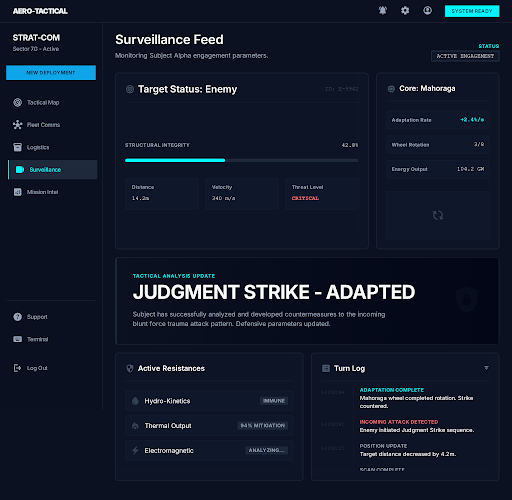
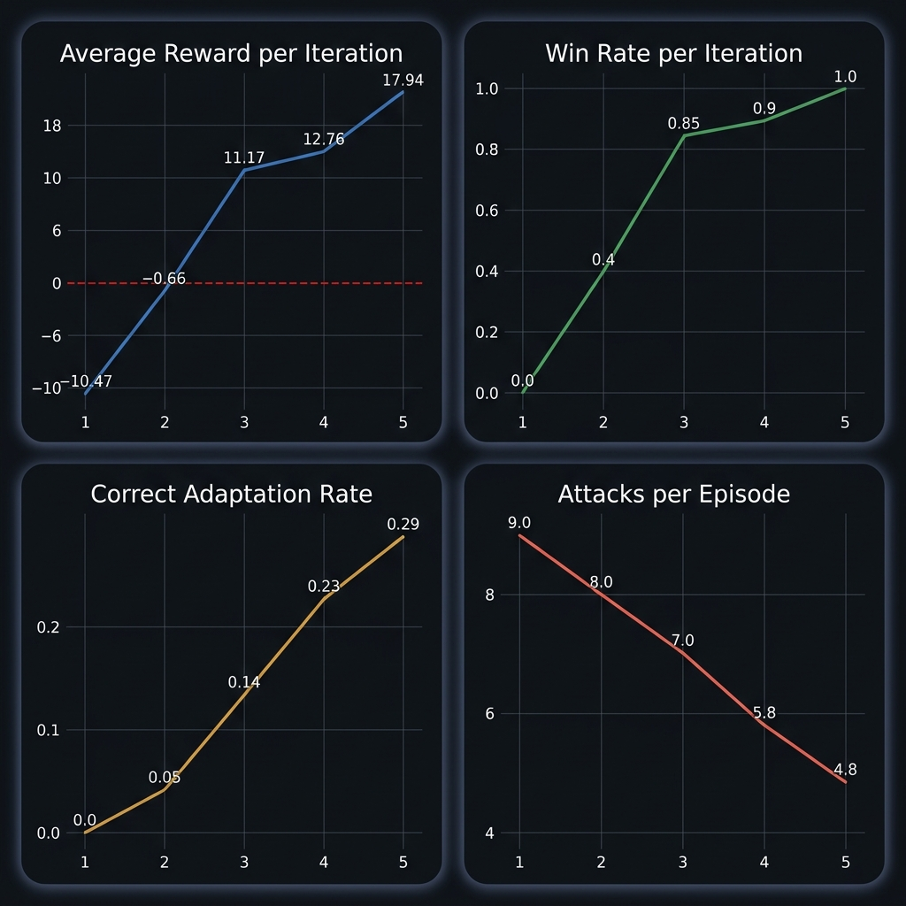

# Project Mahoraga

Project Mahoraga is a custom reinforcement-learning combat environment for studying adaptive agent behavior through resistance tradeoffs, curriculum enemy design, reward decomposition, and optional Qwen 2.5 LoRA auto-play.

The useful engineering problem is not the combat theme. The useful problem is designing an environment where adaptation, reward shaping, and agent behavior can be inspected turn by turn.



---

## What It Is

Mahoraga is a compact, testable RL environment where an agent learns adaptive combat behavior by balancing resistance, attack timing, healing, and reward signals.

The system is split into a Python environment core, a three-phase curriculum enemy, composable reward functions, a Gymnasium wrapper, a FastAPI bridge, a Gradio interface, a React/Vite tactical dashboard, and a Kaggle-oriented Qwen 2.5 3B LoRA training workflow.

## Why It Exists

Most simple combat agents are either scripted or reward-blind. Once the player finds a pattern, the system stops being adaptive and becomes memorization.

Mahoraga explores a cleaner adaptive-agent loop:

- Observe the enemy attack category.
- Adapt resistance to the right threat.
- Accumulate adaptation stacks.
- Time a Judgment Strike.
- Avoid passive healing and over-adaptation.

## Core Loop

```text
Observe -> Adapt -> Accumulate -> Strike -> Learn
```

```text
+-----------------------------+
| Environment Reset           |
| HP, resistances, cooldowns  |
+-------------+---------------+
              |
              v
+-----------------------------+
| Enemy Curriculum Attack     |
| Phase 1 -> Phase 2 -> Phase 3 |
+-------------+---------------+
              |
              v
+-----------------------------+
| Agent Observation           |
| State + attack history      |
+-------------+---------------+
              |
              v
+-----------------------------+
| Action Selection            |
| Manual / rule-based / LLM   |
+-------------+---------------+
              |
              v
+-----------------------------+
| Mechanics + Reward Update   |
| Damage, adaptation, terminal|
+-------------+---------------+
              |
              v
+-----------------------------+
| Training / Evaluation Loop  |
| Reward-weighted SFT + LoRA  |
+-----------------------------+
```

Each episode runs through the same `step(action)` interface. The environment applies enemy damage, agent action effects, reward computation, and terminal checks, then returns updated state plus a named reward breakdown.

---

## System Architecture

```text
meta_Mahoraga/
  env/
    mahoraga_env.py      # environment reset/step orchestration
    mechanics.py         # resistance, damage, healing, Judgment Strike
    enemy.py             # three-phase curriculum enemy
    rewards.py           # named reward components
    state.py             # state dict builder
    gym_wrapper.py       # Gymnasium-compatible wrapper
  utils/
    constants.py         # HP, actions, damage, phase constants
    validators.py        # action validation
  tests/
    test_env.py
    test_gym_wrapper.py
  scripts/
    random_agent_gym.py
    diagnose.py
    trace_medium.py
  notebooks/
    meta-mahoraga.ipynb
  frontend/              # React + Vite tactical dashboard
  api.py                 # FastAPI bridge
  app.py                 # Gradio interface
  main.py                # CLI/random episode runner
```

### Runtime Paths

| Path | Purpose |
|---|---|
| `main.py` | CLI/random episode runner. |
| `app.py` | Gradio UI. |
| `api.py` | FastAPI bridge and optional Qwen/LoRA auto-play path. |
| `frontend/` | React tactical dashboard. |
| `env/gym_wrapper.py` | Gymnasium-compatible wrapper. |
| `notebooks/meta-mahoraga.ipynb` | Kaggle training notebook. |

### API Endpoints

| Method | Endpoint | Purpose |
|---|---|---|
| `POST` | `/api/reset` | Reset combat state. |
| `POST` | `/api/step` | Execute one manual action. |
| `POST` | `/api/auto-step` | Let the trained LLM or fallback agent choose the next action. |
| `GET` | `/api/model-status` | Check LoRA model load status. |

---

## Mechanics

### Action Space

| Action id | Action | Effect |
|---:|---|---|
| 0 | Adapt PHYSICAL | Increase PHYSICAL resistance. |
| 1 | Adapt CE | Increase CE resistance. |
| 2 | Adapt TECHNIQUE | Increase TECHNIQUE resistance. |
| 3 | Judgment Strike | Deal burst/base damage, consume stack, reset resistances. |
| 4 | Regeneration | Heal agent HP, subject to cooldown. |

### Core Constants

| Constant | Value |
|---|---:|
| `MAX_HP` | 1200 |
| `ENEMY_HP` | 1000 |
| `MAX_TURNS` | 25 |
| `ADAPT_INCREASE` | 40 |
| `ADAPT_DECREASE` | 20 |
| `RESISTANCE_MIN` | 0 |
| `RESISTANCE_MAX` | 80 |
| `JUDGMENT_BASE_DAMAGE` | 100 |
| `JUDGMENT_BURST_DAMAGE` | 350 |
| `HEAL_AMOUNT` | 300 |
| `HEAL_COOLDOWN` | 3 |
| `ARMOR_BYPASS_RATIO` | 0.2 |
| `PHASE_1_END` | 5 |
| `PHASE_2_END` | 15 |
| `PHASE_2_DEVIATION` | 0.15 |

### Resistance

Resistance categories:

- `PHYSICAL`
- `CE`
- `TECHNIQUE`

When adapting to one category:

- Target category increases by `+40`.
- Other categories decrease by `-20`.
- All values are clamped to `[0, 80]`.

### Enemy Curriculum

| Phase | Turns | Behavior |
|---|---:|---|
| Phase 1 | 1-5 | Always attacks with `PHYSICAL`. |
| Phase 2 | 6-15 | Cycles `PHYSICAL -> CE -> TECHNIQUE` with 15 percent random deviation. |
| Phase 3 | 16-25 | Targets the agent's lowest resistance category. |

Attack categories and subtypes:

| Category | Subtypes |
|---|---|
| `PHYSICAL` | `SLASH`, `IMPACT`, `PIERCE` |
| `CE` | `BLAST`, `WAVE`, `BEAM` |
| `TECHNIQUE` | `SPIKE`, `DELAYED`, `PATTERN` |

`PIERCE` sets `ignore_armor=True` and bypasses 20 percent of resistance.

### Damage

Base damage by category:

| Category | Base damage |
|---|---:|
| `PHYSICAL` | 120 |
| `CE` | 150 |
| `TECHNIQUE` | 220 |

Formula:

```python
damage = base_damage * (1 - resistance / 100.0)
```

If `ignore_armor=True`, resistance is reduced by 20 percent before damage is computed.

### Judgment Strike

Judgment Strike rewards timing. It is strongest when the agent has recently adapted to the same category the enemy is using, and it consumes the accumulated adaptation stack.

```text
No match:      100 + (adaptation_stack * 50)
Correct match: 350 + (adaptation_stack * 50)
After strike: resistances reset, stack resets
```

### Regeneration

Regeneration:

- Heals `300` HP.
- Caps at `MAX_HP = 1200`.
- Sets a `3` turn cooldown.
- Does not reset resistances.
- Is nullified if used while on cooldown.

---

## State And Rewards

### State Shape

```python
{
    "agent_hp": int,
    "enemy_hp": int,
    "resistances": {
        "physical": int,
        "ce": int,
        "technique": int
    },
    "last_enemy_attack_type": str | None,
    "last_enemy_subtype": str | None,
    "last_action": int | None,
    "turn_number": int,
    "attack_history": list[str]
}
```

Environment step shape:

```python
state, total_reward, done, info = env.step(action)
```

`info` includes:

- `damage_taken`
- `damage_dealt`
- `correct_adaptation`
- `adaptation_stack`
- `heal_on_cooldown`
- `reason` when terminal
- `reward_breakdown`

### Reward Design

| Component | Formula / condition | Purpose |
|---|---|---|
| `survival` | `-(damage_taken / 100.0)` | Penalize taking damage. |
| `combat` | `damage_dealt / 80.0` | Reward dealing damage. |
| `adaptation` | `0.8` if adaptation matches enemy category, else `0.0` | Reward correct defensive adaptation. |
| `anti_cowardice` | `-1.0` if regeneration is used above 70 percent HP | Discourage unnecessary healing. |
| `efficiency` | `1.0` if damage dealt is at least `200`, else `0.0` | Encourage high-impact burst turns. |
| `terminal` | `10.0` on win, `-8.0` on loss | Reward episode result. |
| `opportunity` | `-0.5` if stack is at least 2 and action is not Judgment | Discourage delaying a good Judgment Strike. |

Each step returns a named reward breakdown, making it possible to inspect whether behavior is driven by survival, combat, correct adaptation, efficiency, terminal result, or anti-exploit penalties.

---

## Training Pipeline

The training workflow is notebook-based and designed for Kaggle GPU execution.

Source-described setup:

- **Base model:** Qwen 2.5 3B Instruct
- **Adapter method:** LoRA
- **Loading mode:** 4-bit in notebook context
- **Training method:** reward-weighted supervised fine-tuning
- **Notebook:** `notebooks/meta-mahoraga.ipynb`
- **Accelerator metadata:** NVIDIA Tesla T4

Training loop:

```text
collect episodes -> reward-weight actions -> SFT train -> save checkpoint -> log metrics
```

The notebook reports v2 changes including rebalanced rewards, episode-level weighting, action diversity enforcement, and expert seeding.

---

## Results

The source training notebook reports improvement from early negative-reward behavior to a final 10-episode evaluation average reward of `18.55` with `100%` win rate. These numbers describe the notebook evaluation setup and should not be treated as broad proof of robust adaptive intelligence.

| Metric | Early training | Final evaluation |
|---|---:|---:|
| Average reward | -10.47 | 18.55 |
| Win rate | 0% | 100% in 10-episode eval |
| Common finish length | Failed / long episodes | 4-7 attacks |
| Adaptation behavior | Mostly ineffective | Regular correct adaptation before burst |

The strongest evidence is the inspectable environment mechanics and reward breakdown, not the theme or a single headline metric.

---

## UI And Demo

### Tactical Dashboard



The dashboard exposes HP bars, resistance bars, adaptation stack, cooldowns, turn logs, difficulty state, manual controls, and auto-play controls.

### Training Metrics



Training metrics are useful context for the notebook evaluation, but they should be interpreted with the methodology caveat above.

### Public Links

| Link | Status |
|---|---|
| [GitHub repository](https://github.com/Atishay9828/meta_Mahoraga) | Public repo. |
| [Kaggle notebook](https://www.kaggle.com/code/atishay9828/meta-mahoraga/edit) | Public notebook page. |
| [Hugging Face Space](https://huggingface.co/spaces/MridulNegi2005/Project-Mahoraga) | Public Space; may cold-start if sleeping. |

---

## How To Run

### Backend Setup

```bash
git clone https://github.com/Atishay9828/meta_Mahoraga.git
cd meta_Mahoraga
python -m venv .venv
.venv\Scripts\activate
pip install -r requirements.txt
```

### CLI Episode

```bash
python main.py
```

### Gradio UI

```bash
python app.py
```

### FastAPI + React Dashboard

```bash
# Terminal 1
python api.py

# Terminal 2
cd frontend
npm install
npm run dev
```

Default local URLs:

- FastAPI: `http://localhost:8000`
- React dashboard: `http://localhost:5173`
- Gradio: `http://localhost:7860`

---

## Tech Stack

| Area | Tools |
|---|---|
| Backend / environment | Python, FastAPI, Uvicorn, Pydantic, Gradio, Requests |
| ML / training | PyTorch, Transformers, PEFT, BitsAndBytes, Accelerate, Qwen 2.5 3B, LoRA |
| RL / environment | Custom turn-based environment, Gymnasium wrapper, discrete action space, curriculum enemy, reward decomposition |
| Frontend | React, Vite, Tailwind CSS, Framer Motion |

---

## Tests / Current Status

This README avoids claiming current test-pass status.

Current local validation notes:

- `python -m pytest tests\test_env.py -q` could not run because `pytest` is not installed in the available Python runtime.
- `python -m pytest tests\test_gym_wrapper.py -q` failed for the same missing `pytest` dependency.
- `python tests\test_env.py` starts running checks, then fails when `MahoragaEnv.__init__()` passes `difficulty=...` into `CurriculumEnemy(...)`.
- `python tests\test_gym_wrapper.py` fails for the same constructor mismatch through `MahoragaGymEnv`.

Known local source issue:

- `CurriculumEnemy.__init__()` currently takes no `difficulty` parameter.
- That constructor mismatch must be fixed before repeating historical claims like `143/143 passing`.

---

## Limitations

Mahoraga is best understood as an environment and reward-design experiment, not a production AI system.

- Reward hacking remains possible.
- Over-adaptation can happen if reward weights are imbalanced.
- Training metrics are notebook-evaluation results, not a broad benchmark.
- The current local source checkout needs a small enemy-constructor fix before test-pass claims should be repeated.
- The Hugging Face Space may cold-start.
- Dashboard visuals prove the UI artifact exists; they do not prove broad model robustness.

---

## Future Work

- Fix the `CurriculumEnemy` difficulty constructor mismatch.
- Re-run environment and Gym wrapper tests in a clean environment.
- Add deterministic evaluation scripts by enemy phase.
- Add replay export for comparing agent behavior across checkpoints.
- Track win rate, average reward, average episode length, action distribution, adaptation accuracy, and failure modes.
- Replace reward-weighted SFT with PPO/GRPO only if compute and stability allow.
- Add API/dashboard integration tests.
- Add a short demo clip showing actual adaptive behavior.

---

## Author

Built by **Atishay Jain** and **Mridul Negi** for the Meta OpenEnv Hackathon 2026.

